# EasySobi-React-app

## Info

[EasySobi REST API](https://github.com/YehyeokBang/EasySobi-Server)를 이용한 프론트엔드 프로젝트  
쉬운 <b>소비기한</b> 관리 서비스

## 소비기한이란?

기존 식품의 판매 허용 기한인 유통기한은 영업자 중심의 기한이었습니다.  
하지만 소비기한은 보관 방법 준수 시 안전하게 섭취 가능한
기한을 알려주는 소비자 중심의 기한 표시제입니다.  
유통기한보다 소비기한이 더 길거나 같을 수 있습니다.

## 기대

소비기한 계산 및 식품 관리 기능으로 우리가 먹는
식품 안전성 증가 및 음식물 쓰레기 감소를 기대할 수 있습니다.

## 제작

React를 사용하여 제작했습니다.  
Kakao javascript용 SDK와 REST API를 사용하여 카카오 회원가입 및 로그인 기능을 구현했습니다.

## 기능

회원가입 및 로그인

- 카카오 로그인 API를 사용하여 회원 관리
- 처음 로그인한 유저도 별도의 회원가입 과정없이 서비스를 이용할 수 있습니다.  
  (처음 온 유저는 자동 회원가입 후 로그인, 회원인 유저는 로그인)

1. 첫 화면  
   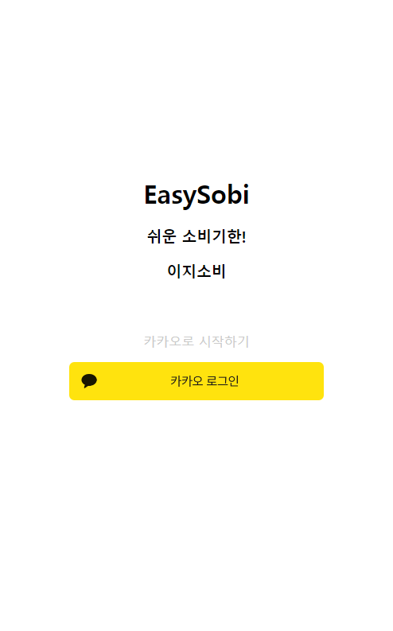 
2. 로그인  
   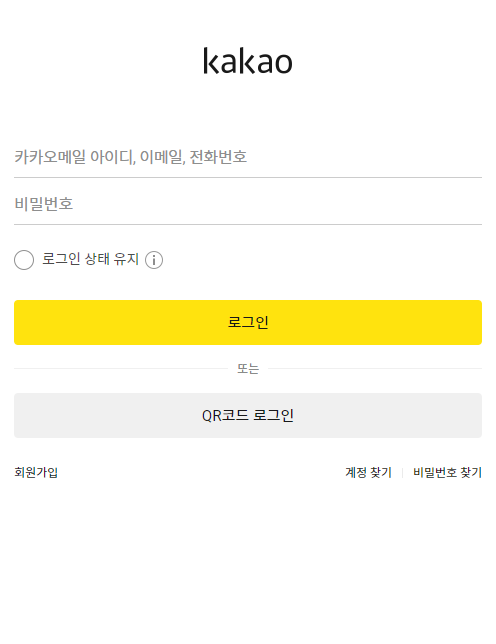 
3. 완료  
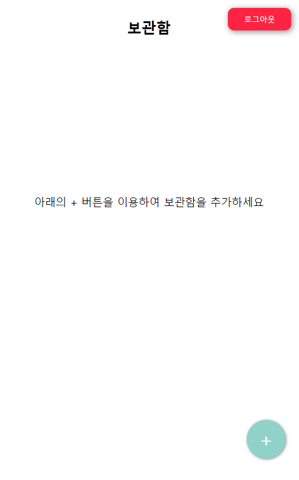 

보관함

- 보관함 조회/생성/수정/삭제
- 보관함 삭제시 Push 알람 기능

1. 메인 화면 (조회)  
   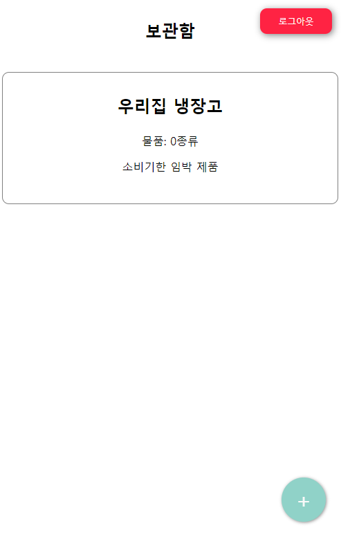 
   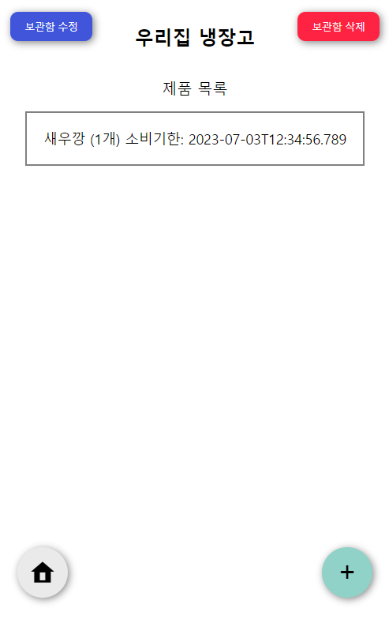 
2. 생성  
   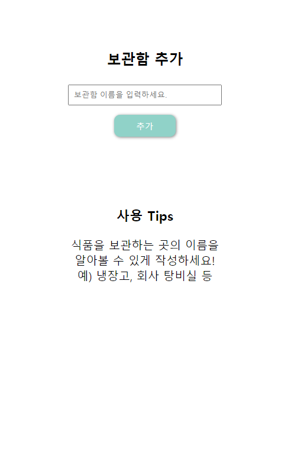 
3. 수정  
   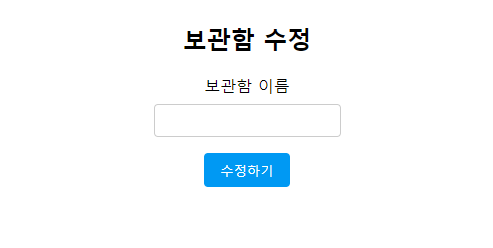 
4. 삭제  
   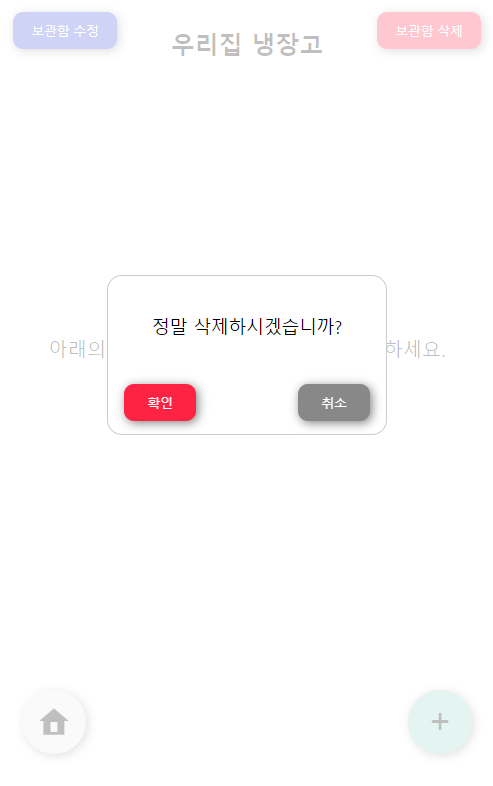 
5. 삭제시 Push 알람  
   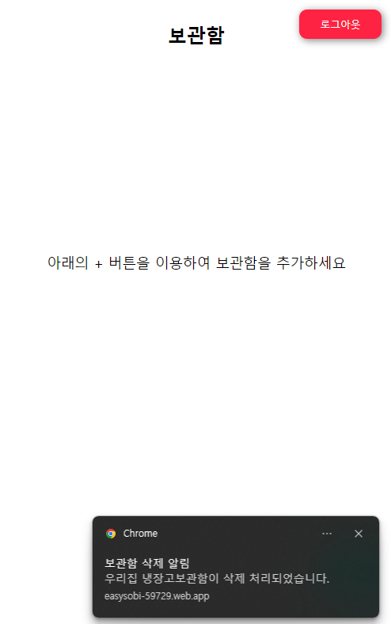 
6. 소비기한 만료 임박 식품 데이터

- 소비기한이 일주일 남은 식품 정보
- 해당 보관함에 저장된 식품 개수 정보  
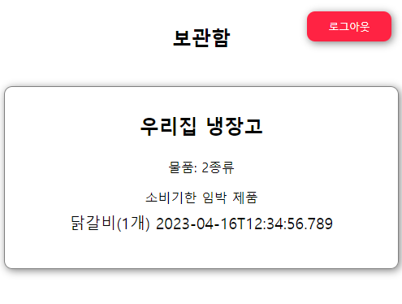 

식품

- 보관함 내 식품 조회/생성/수정/삭제
- 식품 소비기한 만료시 Push 알람(준비 중)

1. 보관함 화면 (조회)  
    
   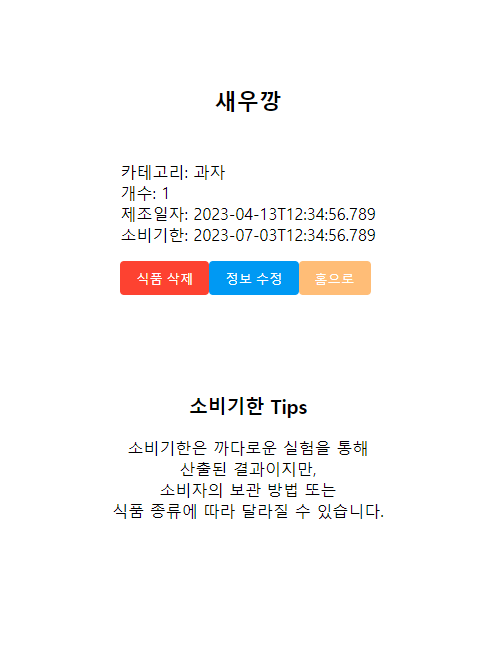 
2. 생성  
   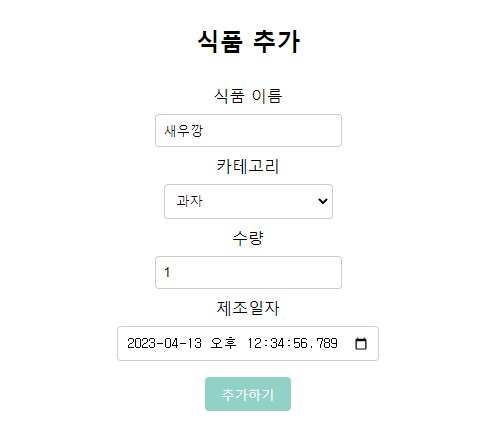 
3. 수정  
   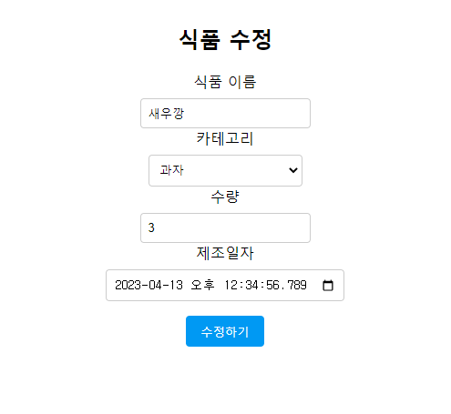 
4. 삭제  
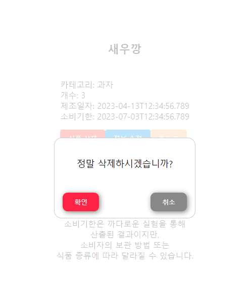 

 

## Kakao Auth

javascript용 SDK를 사용하여 카카오 로그인을 구현했습니다.

## Firebase Cloud Messaging

FCM을 사용하여 Web Push 알람을 구현했습니다.

> 현재는 보관함 삭제 시 특정 보관함이 삭제되었다는 Push 알람을 받게 됩니다.

## Deploy

Firebase Hosting을 사용하여 배포하였습니다.  
[배포 주소](https://easysobi-59729.web.app/)
